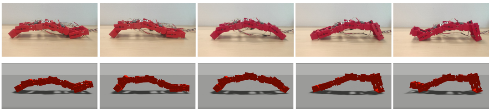

# EDMO snake robot with Central Pattern Generation Controller

This setup is tested using ROS Noetic and Gazebo 11.



## General visualization commands

To visualize the EDMO snake robot modules and TF tree in RViz, run the following command:
```
roslaunch edmo_sim display.launch
```

To start the Gazebo simulation with spawned EDMO snake robot and enabled controllers, run the following command:
```
roslaunch edmo_sim sim_eval_realtime.launch
```

Control robot joints using the RQT GUI:
```
rosrun rqt_gui rqt_gui
```
or control joints usin the CPG controller:
```
rosrun edmo_sim cpg_control.py __ns:=edmo1 /clock:=/edmo1_clock/
```

## Optimization setup commands

To start 3 parallel EDMO simulations with 6x times speed increase, run:
```
roslaunch edmo_sim sim_eval_headless_comms.launch --screen
```

Now in separate terminals run CPG controller for each robot
```
rosrun edmo_sim connection_cpg_fitness.py __ns:=edmo1 /clock:=/edmo1_clock/
rosrun edmo_sim connection_cpg_fitness.py __ns:=edmo2 /clock:=/edmo2_clock/
rosrun edmo_sim connection_cpg_fitness.py __ns:=edmo3 /clock:=/edmo3_clock/
```